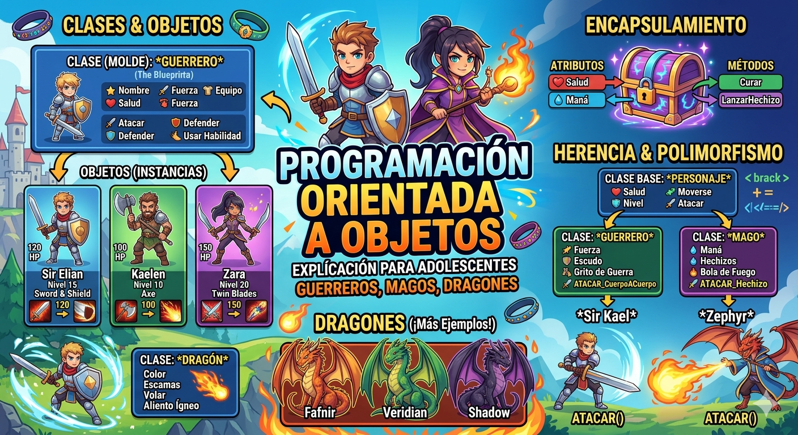
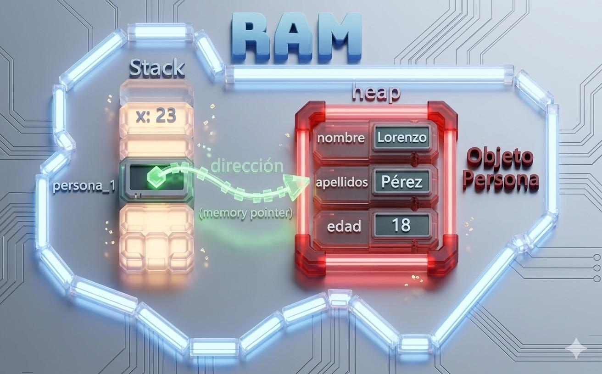

# python_POO
Introducción a la programación orientada a objetos (POO) en Python

## Porque es importante aprender POO?

- imagina que quieres crear un videojuego, ienes guerreros, magos, dragones...  cada uno con sus propios puntos de vida, ataques y habilidades. ¿como los organizo en codigo sin repetir una y otra vez?

- La **Programacion orientada a objetos (POO)** es la respuesta, en lugar de escribir instrucciones sueltas, modelas el mundo real con *objetos* que tienen caracteristicas y comportamientos. Es la forma en que estan construidos la mayoria de programas profesionales del mundo.



## Clase y objeto

- una clase es un tipo de dato cuyas variables se llaman objetos o instancias.

- La clase es la definicion del concepto del mundo real y los objetos o instancias son el propio "objeto" del mundo real.

- Las clases estan compuestas por 2 elementos:
    - **Atributos:** informacion que almacena la clase.
    - **Métodos:** operaciones que puede realizarse con la clase.

## Definicion de una clase en python

``` Python
class NombreClase:

    def __init__(self, variable, variable2):
        self.atributo1 = valor1
        self.atributo2 = valor2

    def nombreMetodo(self):
        BloqueCodigo
```

-  `class` : palabra reservada en Python para definir una clase
- `NombreClase` : nombre de la clase que se quiere crear
- `def`: Palabra resernada en Python que se utiiza para definir tanto el constructor de la clase (método que se ejecuta la primera vezque usas en una clase) como los diferentes metodos que tiene.
- `__init__` : palabra reservada en Python para definir el método constructor de la clase. El metodo `__init__` es lo primero que se ejecuta cuando creas un objeto de una clase.
- `(self, variablex)` : parametro del constructor de la clase.  El parametro self es obligatorio y despues puedes tener tantos parametros como quieras. La frma de añadir parametros es la misma que en las funciones.
- `self.atributox` : forma de utilizacion y acceso a los atributos de la clase
- `NombreMetodo` : Nombre del metodo de la clase.
- `self` : parametro del metodo. El parametro `self`es obligatorio y despues puedes tener tantos parametros como quieras. La forma de añadir parametros es la misma que en las funciones.
- `BloqueCodigo` : instrucciones que ejecutara el metodo.

**Al definir una clase tenga en cuenta:**
- Puedes definir tantos atributos como necesites.
- Puedes definir tantos metodos como necesites.
- Puedes definir tantos parametros en el constructor y en los metodos como necesites.

## Ejemplo 1:

- crear una clase ue represente una persona.
- los atributos que crearemos seran:
    - nombre
    - apellidos
    - edad
- los metodos que crearemos seran:
    - mostrar la informacion de la persona.

### Codigo

```Python
class Persona:
    def __init__(self,nombre, apellidos, edad):
        self.nombre = nombre
        self.apellidos = apellidos
        self.edad = edad

# Metodo para mostrar la informacion de la persona
    def mostrarPersona(self):
        print("Nombre: ", self.nombre)
        print("Apellidos: ", self.apellidos)
        print("Edad: ", self.edad)

def main():
    print("Vamos a aprender POO...")
    persona_1 = Persona("Lorenzo", "Perez", 18)
    persona_1.mostrarPersona()

if __name__ == "__main__":
    main()
```

## Representacion en RAM del objeto creado



