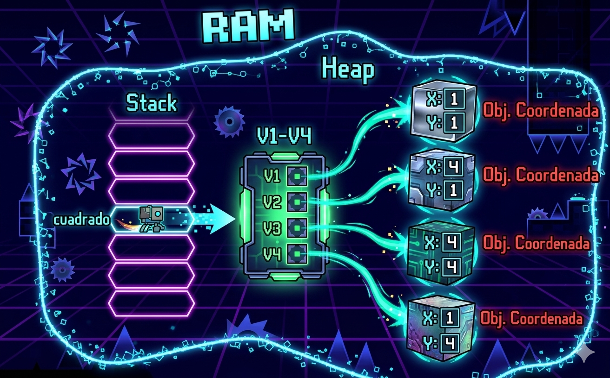

# python_POO
Introducción a la programación orientada a objetos (POO) en Python

## Porque es importante aprender POO?

- imagina que quieres crear un videojuego, ienes guerreros, magos, dragones...  cada uno con sus propios puntos de vida, ataques y habilidades. ¿como los organizo en codigo sin repetir una y otra vez?

- La **Programacion orientada a objetos (POO)** es la respuesta, en lugar de escribir instrucciones sueltas, modelas el mundo real con *objetos* que tienen caracteristicas y comportamientos. Es la forma en que estan construidos la mayoria de programas profesionales del mundo.


## Clase y objeto

- una clase es un tipo de dato cuyas variables se llaman objetos o instancias.

- La clase es la definicion del concepto del mundo real y los objetos o instancias son el propio "objeto" del mundo real.

- Las clases estan compuestas por 2 elementos:
    - **Atributos:** informacion que almacena la clase.
    - **Métodos:** operaciones que puede realizarse con la clase.

## Definicion de una clase en python

``` Python
class NombreClase:

    def __init__(self, variable, variable2):
        self.atributo1 = valor1
        self.atributo2 = valor2

    def nombreMetodo(self):
        BloqueCodigo
```

-  `class` : palabra reservada en Python para definir una clase
- `NombreClase` : nombre de la clase que se quiere crear
- `def`: Palabra resernada en Python que se utiiza para definir tanto el constructor de la clase (método que se ejecuta la primera vezque usas en una clase) como los diferentes metodos que tiene.
- `__init__` : palabra reservada en Python para definir el método constructor de la clase. El metodo `__init__` es lo primero que se ejecuta cuando creas un objeto de una clase.
- `(self, variablex)` : parametro del constructor de la clase.  El parametro self es obligatorio y despues puedes tener tantos parametros como quieras. La frma de añadir parametros es la misma que en las funciones.
- `self.atributox` : forma de utilizacion y acceso a los atributos de la clase
- `NombreMetodo` : Nombre del metodo de la clase.
- `self` : parametro del metodo. El parametro `self`es obligatorio y despues puedes tener tantos parametros como quieras. La forma de añadir parametros es la misma que en las funciones.
- `BloqueCodigo` : instrucciones que ejecutara el metodo.

**Al definir una clase tenga en cuenta:**
- Puedes definir tantos atributos como necesites.
- Puedes definir tantos metodos como necesites.
- Puedes definir tantos parametros en el constructor y en los metodos como necesites.

## Ejemplo 1:

- crear una clase ue represente una persona.
- los atributos que crearemos seran:
    - nombre
    - apellidos
    - edad
- los metodos que crearemos seran:
    - mostrar la informacion de la persona.

### Codigo

```Python
class Persona:
    def __init__(self,nombre, apellidos, edad):
        self.nombre = nombre
        self.apellidos = apellidos
        self.edad = edad

# Metodo para mostrar la informacion de la persona
    def mostrarPersona(self):
        print("Nombre: ", self.nombre)
        print("Apellidos: ", self.apellidos)
        print("Edad: ", self.edad)

def main():
    print("Vamos a aprender POO...")
    persona_1 = Persona("Lorenzo", "Perez", 18)
    persona_1.mostrarPersona()

if __name__ == "__main__":
    main()
```

## Representacion en RAM del objeto creado


## Composición

- Consiste en la creacion de nuevas clases a partir de otras clases ya existentes que actuan como elementos compositores de la nueva.
- Las clases existentes seran atributos de la nuea clase.

### Ejemplo

- una coordenada en dos dimensiones esta compuesta por 2 valores, el valor del eje de las x y el valor del eje de las y. Esto podria ser una clase.
- Un cuadrado esta compuesto por 4 coordenadas que son los 4 vertices. Esto podria ser una clase que esta compuesta por cuatro clases del objeto coordenada.

### Codigo Python
```Python
class Coordenada:
    # Método constructor
    def __init__(self, x, y):
        self.X = x
        self.Y = y

    def mostrarCoordenada(self):
        print("(",self.X,",",self.Y, ")")

class Cuadrado:
    # Método constructor
    def __init__(self, v1, v2, v3, v4):
        self.V1 = v1
        self.V2 = v2
        self.V3 = v3
        self.V4 = v4

    def mostrarVertices(self):
        print("El cuadrado esta compuesto por los siguientes vertices:")
        self.V1.mostrarCoordenada()
        self.V2.mostrarCoordenada()
        self.V3.mostrarCoordenada()
        self.V4.mostrarCoordenada()
```

## representacion en RAM de la composicion



## Encapsulacion

- uno de los objetivos que tiene la POO es proteger los datos de acceso o usos no controlados, y esto es lo que se conoce como **encapsulacion**.
- los datos (atributos) que componen una clase pueden ser de dos tipos:
    - **Publicos:**     los datos son accesibles sin control, es decir, los datos pueden ser usados sin ningun tipo de mecanismo que proteja ante usos no autorizados o indebidos.
    - **Privado:** los datos no pueden ser accedidos sin control y para acceder a ellos se debera implementar un metodo que accedaa ellos, De esta manera, los datos unicamente seran accedidos directamente por la propia clase.
- La encapsulacion tambien puede realizarse sobre los metodos.
- la definicion de atributos privados se realiza incluyendo los caracteres "__" (dos guiones de piso) entre la palabra *self* y el nombre del atributo.

### Ejemplo

```Python
class Coordenada:
    # Método constructor
    def __init__(self, x, y):
        self.__X = x
        self.__Y = y

    def getX(self):
        return self.__X
    def getY(self):
        return self.__Y
    def setX(self, x):
        self.__X = x
    def setY(self, y):
        self.__Y = y

    def mostrarCoordenada(self):
        print("(",self.__X,",",self.__Y, ")")
#-----------------------
class Cuadrado:
    # Método constructor
    def __init__(self, v1, v2, v3, v4):
        self.V1 = v1
        self.V2 = v2
        self.V3 = v3
        self.V4 = v4


    def mostrarVertices(self):
        print("El cuadrado esta compuesto por los siguientes vertices:")
        self.V1.mostrarCoordenada()
        self.V2.mostrarCoordenada()
        self.V3.mostrarCoordenada()
        self.V4.mostrarCoordenada()

def main():
    v1 = Coordenada(0,0)
    v2 = Coordenada(0,1)
    v3 = Coordenada(1,1)
    v4 = Coordenada(1,0)
    cuadrado = Cuadrado(v1,v2,v3,v4)
    cuadrado.mostrarVertices()

if __name__ == "__main__":
    main()
```

## Herencia
- Permite la reutilización de código.
- Consiste en la definición de una clase utilizando como base una clase ya existente.
- La nueva clase derivada tendrá todas las caracteristicas de la clase base y ampliará el concepto de esta, es decir, tendrá todos los atributos y métodos de la clase base.
- Significa que entre dos clases existe una relación del tipo "es un".
- La herencia en Python se especifica de la siguiente manera: ```class NombreClase(ClaseBase):```
- Ejemplo:
    - Pensemos en una persona como una clase, la persona tendría una serie de atributos como pueden ser el nombre, los apellidos, la edad, etc.  Esas características de una persona serían compartidas por todas aquellas clases hijas como pueden ser alumno y profesor.  Es decir, alumno y profesor heredarían las propiedades de la clase persona y tendrían sus propias propiedades, diferentes entre ellas, como por ejemplo el curso en el que está el alumno y el horario de tutorias del profesor.

    - Clase base: Persona
        - Atributos:
            - Nombre
            - Apellidos
            - Edad

    - Clase derivada: Alumno
        - Atributos:
            - Curso
            - Asignaturas
    
    - Clase derivada: Profesor
        - Atributos:
            - Antigüedad
            - Tutorias
            - Teléfono
